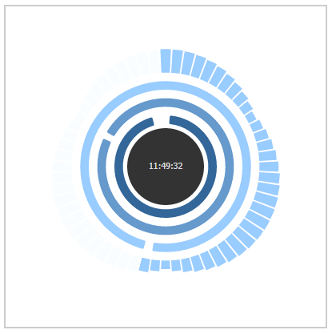

ArcClock
===
Arc-Clock is an abstract, polar clock library that is simple to deploy, customize and use in your web pages. Its only dependency is D3.



Usage
---
ArcClock will work out-of-the-box with a nice blue theme. See image above.
```
<html>
<head>
<script src="WHERE_YOUR_D3_JS_IS_LOCATED"></script>
<script src="aclock.js"></script>
</head>
<body>
<div style="width:300px;height:300px" id="clock1"></div>
</body>
<script>
  var configuration = {}; // Use default
  var clock1 = new ArcClock(configuration); // Init
  clock1.render('#clock1'); // Start render loop
</script>
</html>
```
Additional configuration and styles can be passed into the configuration object.
